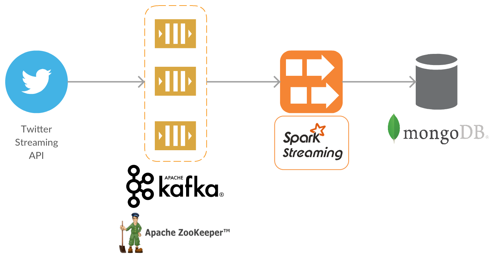

# Real-time streaming data pipeline for Twitter Tweets

## Architecture


**Twitter Streaming API**
http://twitter4j.org/en/

Twitter4J is an unofficial Java library for the Twitter API. Using this library, we can stream real-time tweets, and filter to only return Tweets based on keywords, language, location, etc.Individual Tweets objects streamed from this API are in JSON format

**Apache Kafka and Apache Zookeeper**
https://kafka.apache.org/ &
https://zookeeper.apache.org/

Apache Kafka is a distributed streaming platform with multiple capabilities. I am using Kafka in this application as a publish-subscribe messaging system to reliably get data between pipeline components. Tweets are published to a *topic* in the Kafka brokers, where Kafka manages their partitions and order, and eventually consumed by a subscriber.

Kafka uses Apache Zookeeper.

>ZooKeeper is a centralized service for maintaining configuration information, naming, providing distributed synchronization, and providing group services. All of these kinds of services are used in some form or another by distributed applications.

**Apache Spark Structured Streaming**
https://spark.apache.org/

> Apache Spark is a fast and general-purpose cluster computing system. It provides high-level APIs in Java, Scala, Python and R, and an optimized engine that supports general execution graphs. It also supports a rich set of higher-level tools including Spark SQL for SQL and structured data processing, MLlib for machine learning, GraphX for graph processing, and Spark Streaming.

I use the Structured Streaming API to consume streams of data from Kafka and then write to MongoDB.

> Structured Streaming is a scalable and fault-tolerant stream processing engine built on the Spark SQL engine. You can express your streaming computation the same way you would express a batch computation on static data. The Spark SQL engine will take care of running it incrementally and continuously and updating the final result as streaming data continues to arrive.
> Structured Streaming queries are processed using a micro-batch processing engine, which processes data streams as a series of small batch jobs thereby achieving end-to-end latencies as low as 100 milliseconds and exactly-once fault-tolerance guarantees. 

I pass the data through Spark as-is, because my focus when doing this project was on the pipeline. But any preprocessing/transformations/analytics of the Twitter data would be defined in this component.

**MongoDB**
https://www.mongodb.com/
MongoDB is an open source, document-oriented, NoSQL database.

> MongoDB stores data in flexible, JSON-like documents, meaning fields can vary from document to document and data structure can be changed over time

MongoDB was my choice of storage because of the JSON format of Tweets. Not all tweets have the same fields.

Sample document in MongoDB:


# Usage:
All configuration values needed to be input by the user are in **src/main/resources/application.conf**

I will not go into details for server setups and configurations. Please refer to the official docs.

1. 
Set up an Apache Zookeeper server and an Apache Kafka server. Kafka uses Zookeeper so it must be properly configured to connect to eachother.

Create a topic in Kafka.

Set the BOOTSTRAP_SERVERS to be the comma seperated address(es) of your kafka brokers.
Set the TOPIC to the topic you created
```
kafka {
	BOOTSTRAP_SERVERS = "localhost:9092"
	TOPIC = "topicname"
}
```

2. 
Set the Spark MASTER_URL
> ...specifies the master URL for a distributed cluster, or local to run locally with one thread, local[N] to run locally with N threads, or local[*] to run locally with as many worker threads as logical cores on your machine.
```
spark {
	MASTER_URL = 'local[*]'
}
```

3. 
MongoDB
Instantiate a MongoDB server and create a database and collection for storage. MongoDB Compass is the official GUI for MongoDB (https://www.mongodb.com/products/compass). I recommend this.

Set the connection string, database name and collection name.
```
mongodb {
	CONNECTION_STRING = "mongodb://localhost:27017"
	DATABASE = "dbname"
	COLLECTION = "collectionname"
}
```

4. 
Twitter API configuration
```
Create a twitter account if you do not already have one.
Go to https://apps.twitter.com/ and log in with your twitter credentials.
Click "Create New App"
Fill out the form, agree to the terms, and click "Create your Twitter application"
In the next page, click on "API keys" tab, and copy your "API key" and "API secret".
Scroll down and click "Create my access token", and copy your "Access token" and "Access token secret".
```
Fill in the keys and tokens
```
twittercredentials {
	CONSUMER_KEY = "..."
	CONSUMER_KEY_SECRET = "..."
	ACCESS_TOKEN = "..."
	ACCESS_TOKEN_SECRET = "..."
}
```
5. 
Change KEYWORDS to be a list of words to filter tweets on. Any tweet that contains these words will be returned in the streaming query. Change LANGUAGES to the languages of tweets you want to return. Currently set to english.
```
tweetfilters {
	KEYWORDS = "Scala,Python,Spark,Kafka"
	LANGUAGES = "en"
}
```
6.
Run application using SBT. SBT is a build tool for Scala.
https://www.scala-sbt.org/1.x/docs/index.html

On the command line:

```cd``` into ```data-pipeline```

Run ```sbt run```

7.
Hit Control-C to terminate.


